# System Design — Nativewit Introduction Video

A complete guide to the codebase, the Remotion framework, and every component. Written so that **anyone** — even without React experience — can understand, modify, and extend the project.

---

## Table of Contents

1. [What Does This Project Do?](#what-does-this-project-do)
2. [What Is Remotion?](#what-is-remotion)
3. [Key Remotion Concepts](#key-remotion-concepts)
4. [Project Structure](#project-structure)
5. [Architecture Overview](#architecture-overview)
6. [The Video — Scene by Scene](#the-video--scene-by-scene)
7. [Theme & Design System](#theme--design-system)
8. [Animation System](#animation-system)
9. [Component Deep Dive](#component-deep-dive)
10. [How to Run & Render](#how-to-run--render)
11. [How to Modify the Video](#how-to-modify-the-video)

---

## What Does This Project Do?

This project generates a **23-second company introduction video** for [Nativewit Technologies](https://www.nativewit.in/) — entirely in code. There is no video editor, no timeline tool, and no drag-and-drop interface. Instead, every frame of the video is described by React components and rendered by a framework called **Remotion**.

The output is a 1920×1080, 30 fps video that can be exported as MP4 or previewed live in a browser.

---

## What Is Remotion?

[Remotion](https://www.remotion.dev/) is an open-source framework that lets you **create videos using code** (specifically React and TypeScript). Think of it like a movie-making toolkit where:

- Each "scene" is a **React component** (a reusable piece of UI).
- Time is measured in **frames** instead of seconds (at 30 fps, 1 second = 30 frames).
- Animations are created by computing styles (position, opacity, scale) based on the current frame number.

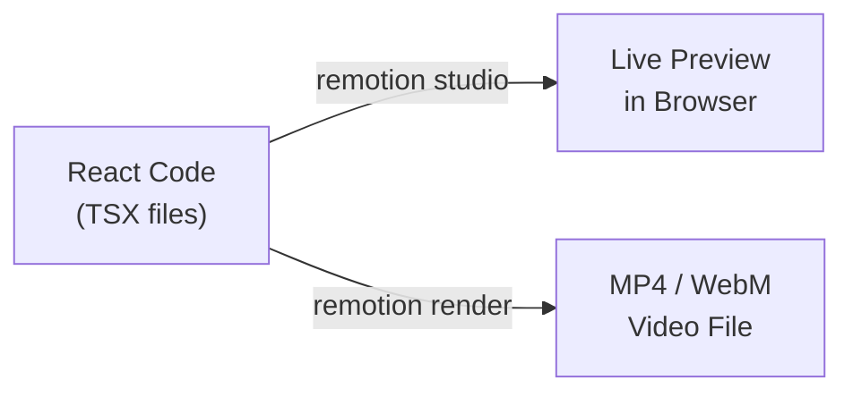

### Why Not Use a Video Editor?

| Feature | Remotion (Code) | Traditional Editor |
|---|---|---|
| Reusable templates | ✅ Build once, reuse anywhere | ❌ Manually copy-paste |
| Data-driven content | ✅ Populate from APIs/arrays | ❌ Type everything by hand |
| Version control | ✅ Track changes with Git | ❌ Binary project files |
| Pixel-perfect consistency | ✅ Computed from math | ⚠️ Manual alignment |
| Learning curve | ⚠️ Requires code knowledge | ✅ Visual interface |

---

## Key Remotion Concepts

If you've never used React or Remotion, here are the five ideas you need to understand everything in this project:

### 1. Component

A **component** is a function that returns visual content (text, shapes, images). Components are reusable building blocks — like Lego bricks.

```
function BlueBox() {
  return <div style={{ width: 100, height: 100, background: 'blue' }} />;
}
```

### 2. Composition

A **Composition** is a "registered video clip". It tells Remotion:
- Which component to render
- How wide and tall the video is (1920×1080)
- How many frames per second (30 fps)
- How many frames total (determines duration)

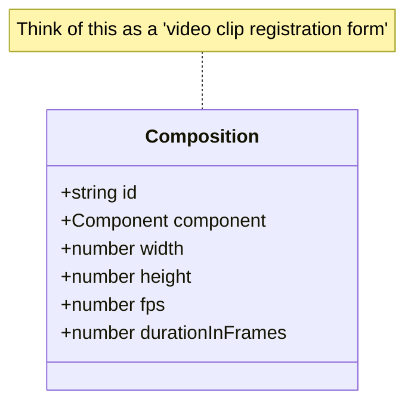

### 3. Frame

A **frame** is one still image in the video. At 30 fps, the video draws 30 frames per second. The function `useCurrentFrame()` returns the current frame number (starting from 0). All animation logic uses this number.

```
Frame 0   → Show nothing (opacity: 0)
Frame 15  → Half visible  (opacity: 0.5)
Frame 30  → Fully visible (opacity: 1.0)
```

### 4. Sequence

A **Sequence** is a time container. It says: "Play this component from frame X for Y frames." Multiple Sequences placed one after another create a multi-scene timeline.

```mermaid
gantt
    title Video Timeline (690 frames / 23 seconds)
    dateFormat X
    axisFormat %s

    section Scenes
    BrandIntro      :0, 90
    HeroStatement   :90, 180
    Services        :180, 330
    Stats           :330, 450
    Process         :450, 570
    Outro           :570, 690
```

### 5. Spring & Interpolate

These are animation functions:

- **`spring()`** — Creates a physics-based bounce/ease effect. Returns a value from 0 to ~1. Used for natural-looking motion.
- **`interpolate()`** — Maps a number from one range to another. Example: map frame 0–30 to opacity 0–1.

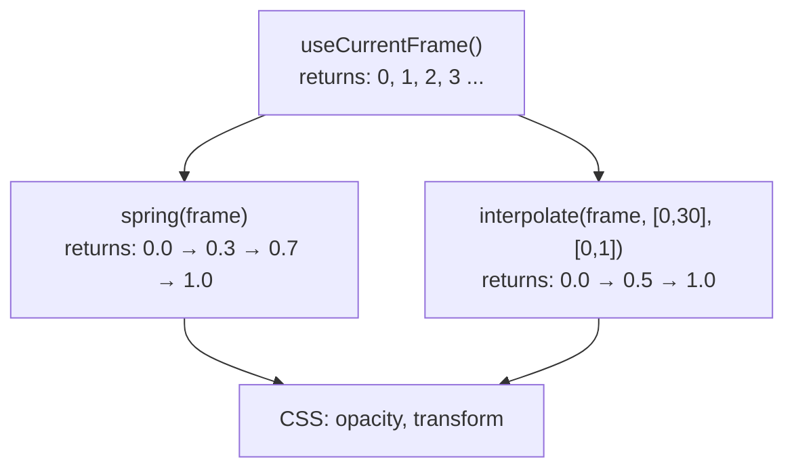

---

## Project Structure

```
remotion/
├── package.json                 # Dependencies & scripts
├── remotion.config.ts           # Output format settings
├── tsconfig.json                # TypeScript config
├── system_design.md             # ← You are here
│
└── src/
    ├── index.ts                 # Entry point — registers the root
    ├── Root.tsx                 # Registers all Compositions
    ├── theme.ts                 # Shared colors, fonts, spacing
    │
    ├── compositions/
    │   └── NativewitIntro.tsx   # Main composition (orchestrates all scenes)
    │
    ├── scenes/
    │   ├── BrandIntro.tsx       # Scene 1 — Logo reveal
    │   ├── HeroStatement.tsx    # Scene 2 — Main tagline
    │   ├── Services.tsx         # Scene 3 — Three service pillars
    │   ├── Stats.tsx            # Scene 4 — Key metrics
    │   ├── Process.tsx          # Scene 5 — How we work
    │   └── Outro.tsx            # Scene 6 — CTA + contact
    │
    └── utils/
        └── markdown.ts          # Animation helper utilities
```

---

## Architecture Overview

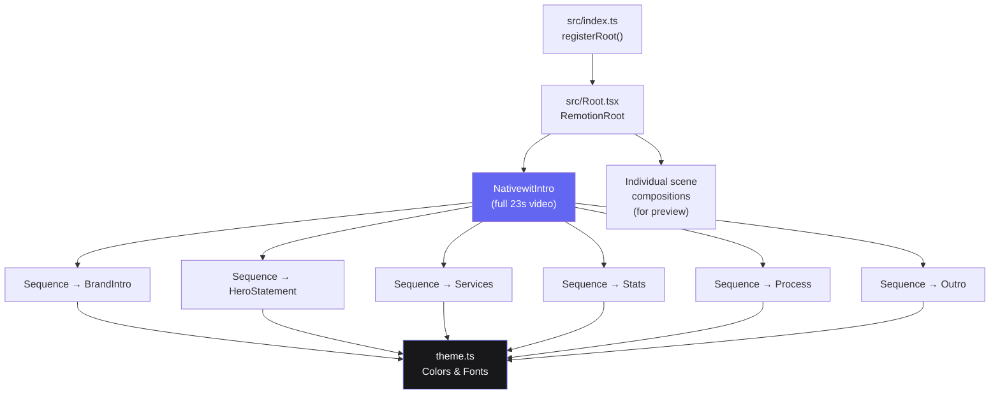

### How the pieces connect

1. **`index.ts`** calls `registerRoot(RemotionRoot)` — this tells Remotion where to find all videos.
2. **`Root.tsx`** registers 7 Compositions: one full intro video + 6 individual scene previews.
3. **`NativewitIntro.tsx`** is the main composition. It uses `<Sequence>` to play each scene one after another.
4. **Each scene** (`BrandIntro.tsx`, etc.) is a self-contained component that reads the current frame and computes styles.
5. **`theme.ts`** provides the shared color palette and font so all scenes look consistent.

---

## The Video — Scene by Scene

### Scene 1: BrandIntro (3 seconds / 90 frames)

**File:** `src/scenes/BrandIntro.tsx`

A minimal, centered logo reveal on a black background.

| Time | Animation |
|---|---|
| 0.0 s | Thin indigo accent line expands from center |
| 0.3 s | "NATIVEWIT" fades in with letter-spacing that tightens |
| 0.8 s | "FLUTTER-FIRST PRODUCT STUDIO" slides up |

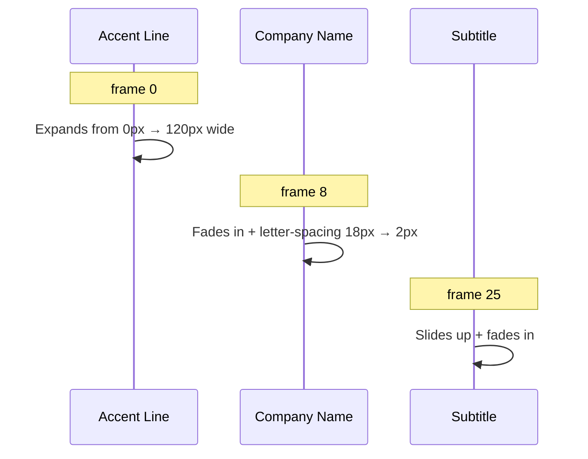

---

### Scene 2: HeroStatement (3 seconds / 90 frames)

**File:** `src/scenes/HeroStatement.tsx`

The company's core tagline in large, bold text.

**What appears on screen:**
- "We engineer products" (white)
- "that ship." (indigo accent)
- An expanding accent underline
- Body text: "Your next product needs more than developers…"

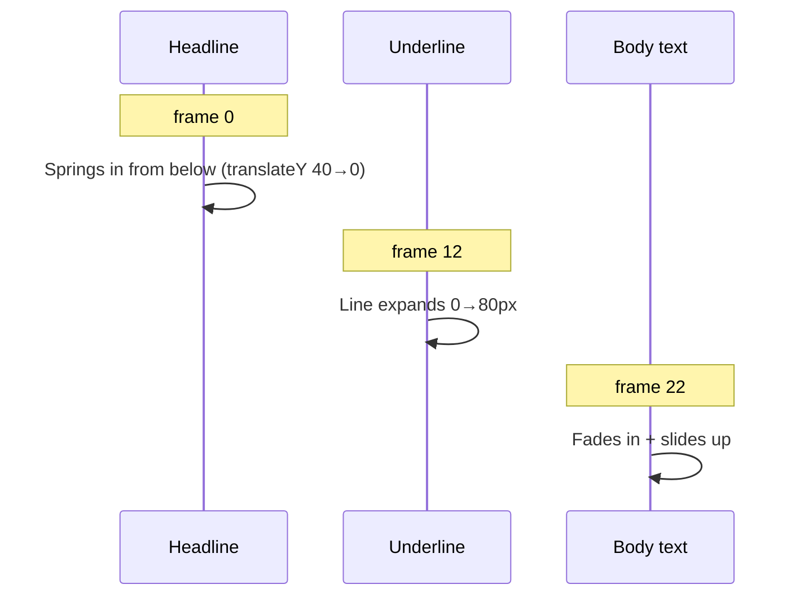

---

### Scene 3: Services (5 seconds / 150 frames)

**File:** `src/scenes/Services.tsx`

Three service cards appear one by one, each containing a number, title, and description.

| Card | Title | Delay |
|---|---|---|
| 01 | Product Engineering | frame 18 |
| 02 | AI Integration | frame 30 |
| 03 | CTO-as-a-Service | frame 42 |

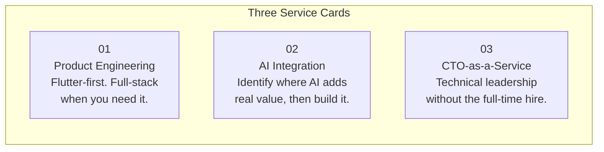

Each card is a dark surface (`#18181b`) with a subtle border, sitting on a pure black background. Cards stagger in with 12-frame delays between each.

---

### Scene 4: Stats (4 seconds / 120 frames)

**File:** `src/scenes/Stats.tsx`

Four key metrics with animated counters that count up from 0 to their final value.

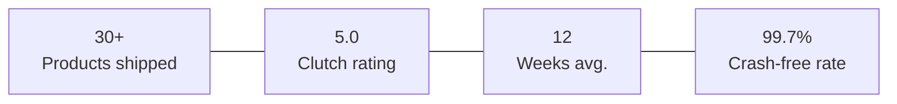

The numbers animate using `interpolate()` — each stat starts counting 10 frames after the previous one, creating a satisfying left-to-right wave effect.

---

### Scene 5: Process (4 seconds / 120 frames)

**File:** `src/scenes/Process.tsx`

Four numbered circles connected by animated lines showing the development process.

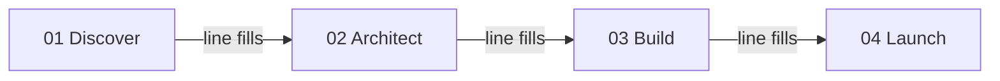

Each step appears with:
1. A numbered indigo circle
2. A connecting line that fills from left to right
3. Title + brief description below

Steps stagger in with 12-frame delays.

---

### Scene 6: Outro (4 seconds / 120 frames)

**File:** `src/scenes/Outro.tsx`

The closing call-to-action on a subtle gradient background.

| Time | Element |
|---|---|
| 0.0 s | "Ready to build your next product?" springs in |
| 0.5 s | Body text slides up |
| 1.0 s | Indigo CTA button scales in |
| 1.5 s | Email + website fades in at bottom |

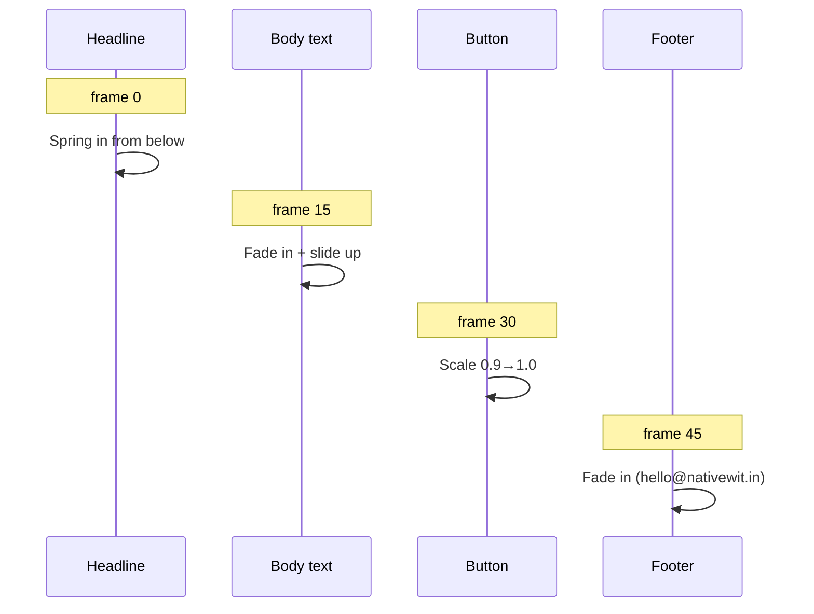

---

## Theme & Design System

**File:** `src/theme.ts`

All scenes import a single `theme` object to ensure visual consistency across the entire video.

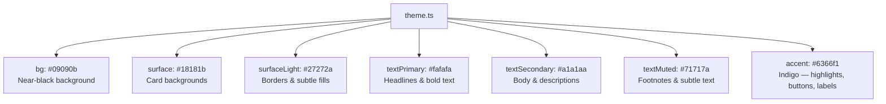

| Token | Hex | Usage |
|---|---|---|
| `bg` | `#09090b` | Full-screen backgrounds |
| `surface` | `#18181b` | Cards, panels |
| `surfaceLight` | `#27272a` | Borders, connecting lines |
| `textPrimary` | `#fafafa` | Headlines |
| `textSecondary` | `#a1a1aa` | Body text |
| `textMuted` | `#71717a` | Footnotes |
| `accent` | `#6366f1` | Buttons, labels, highlights |
| `accentLight` | `#818cf8` | Lighter accent variant |
| `green` | `#22c55e` | Positive metrics |
| `blue` | `#3b82f6` | Links, secondary accent |
| `font` | Inter | Primary typeface, falling back to Helvetica Neue → Arial → sans-serif |

The palette is derived from **Tailwind CSS Zinc + Indigo** scales, matching the visual language of [nativewit.in](https://www.nativewit.in/).

---

## Animation System

Every animation in the project follows the same pattern:

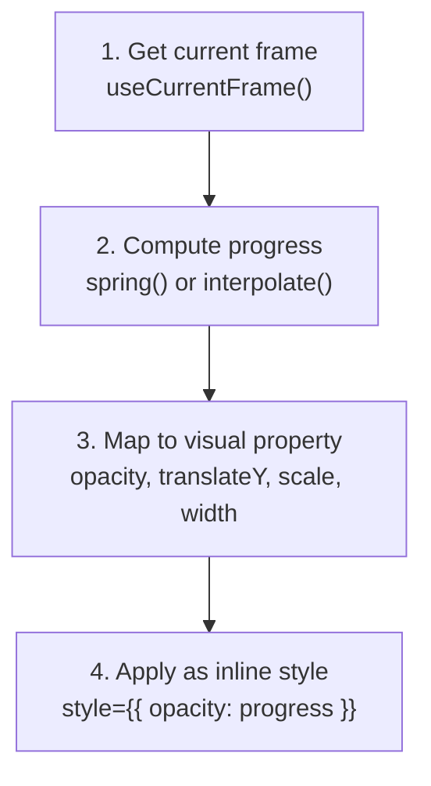

### spring() — Natural Motion

`spring({ frame, fps, config })` returns a value that starts at 0, overshoots slightly, then settles at ~1. The `config` object controls:

- **`damping`** — Higher = less bounce (this project uses 80–120 for smooth motion).
- **`mass`** — Higher = heavier / slower movement.

### interpolate() — Linear Mapping

`interpolate(value, inputRange, outputRange)` maps a number from one range to another. Used for:

- **Opacity**: `interpolate(progress, [0,1], [0,1])` → 0% to 100% visible
- **Position**: `interpolate(progress, [0,1], [40,0])` → slide up 40px to final position
- **Width**: `interpolate(progress, [0,1], [0,120])` → line grows from 0 to 120px

### Staggered Animations

Multiple items (service cards, stats, process steps) animate one after another by offsetting the frame value:

```
Item 0: spring({ frame: frame - 0,  ... })  → starts immediately
Item 1: spring({ frame: frame - 12, ... })  → starts 12 frames (0.4s) later
Item 2: spring({ frame: frame - 24, ... })  → starts 24 frames (0.8s) later
```

This creates a satisfying cascade/wave effect without any complex timeline management.

---

## Component Deep Dive

### What Is a React Component? (For Non-React Developers)

A React component is just a **function that returns HTML-like markup**. Here's the simplest possible example:

```tsx
function HelloWorld() {
  return <div>Hello, World!</div>;
}
```

In this project, each scene is a component. The component receives the current frame number and uses math to decide what the screen should look like at that exact moment.

### How a Scene Component Works

Every scene follows this pattern:

```
┌──────────────────────────────────────────────────┐
│  1. Import Remotion tools (spring, interpolate)  │
│  2. Import theme (colors, fonts)                 │
│  3. Get current frame number                     │
│  4. Calculate animation values                   │
│  5. Return JSX with computed styles              │
└──────────────────────────────────────────────────┘
```

Example walkthrough using `BrandIntro.tsx`:

```tsx
// Step 1 — Import tools
import { spring, interpolate, useCurrentFrame, useVideoConfig } from "remotion";

// Step 2 — Import theme
import { theme } from "../theme";

// Step 3 — The component function
export const BrandIntro = () => {
  const frame = useCurrentFrame();       // Step 3b — Get frame (0, 1, 2, ...)
  const { fps } = useVideoConfig();       // Get framerate (30)

  // Step 4 — Calculate animation
  const nameProgress = spring({ frame, fps });  // 0 → ~1 over ~20 frames

  // Step 5 — Return visual with animated styles
  return (
    <div style={{ opacity: nameProgress }}>
      <h1>Nativewit</h1>
    </div>
  );
};
```

### NativewitIntro.tsx — The Orchestrator

This component doesn't render anything visual itself. It lines up all scene components using `<Sequence>`:

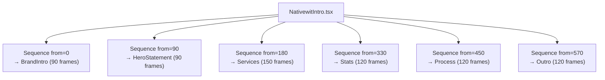

The `from` value tells Remotion which global frame to start the scene, and `durationInFrames` tells it when to stop. Each scene's internal `useCurrentFrame()` resets to 0 within its Sequence.

### Root.tsx — The Registration Hub

This file registers **7 Compositions** with Remotion:

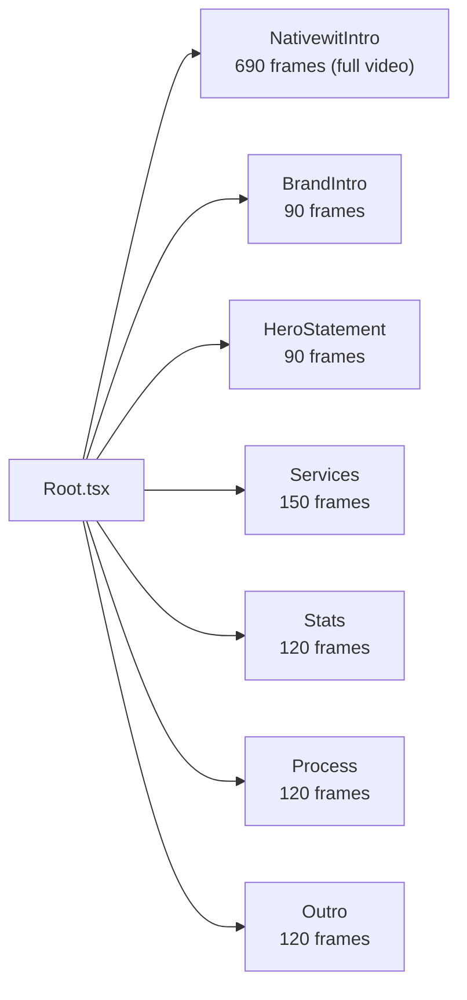

The individual scene compositions are registered separately so you can preview and iterate on each scene without watching the entire 23-second video.

---

## How to Run & Render

### Prerequisites

- [Node.js](https://nodejs.org/) 18 or newer
- npm (comes with Node.js)

### Install dependencies

```bash
npm install
```

### Start the Remotion Studio (live preview)

```bash
npm run dev
```

Opens a browser at `http://localhost:3000` where you can:
- Select any composition from the sidebar
- Scrub through the timeline frame-by-frame
- Play/pause the video
- See live updates as you edit code

### Render to video file

```bash
npm run build
```

This exports the video as a file. Output settings are in `remotion.config.ts`:
- Image format: JPEG (faster rendering)
- Overwrite existing output: enabled

### Upgrade Remotion

```bash
npm run upgrade
```

---

## How to Modify the Video

### Change text or wording

Open the scene file (e.g., `src/scenes/HeroStatement.tsx`) and edit the JSX text directly. Save → the preview updates instantly.

### Change colors

Edit `src/theme.ts`. All scenes import from this file, so one change updates everything.

### Change timing

Durations are defined in `src/compositions/NativewitIntro.tsx` in the `SCENE_DURATIONS` object:

```ts
export const SCENE_DURATIONS = {
  brandIntro: 90,      // 3 seconds at 30fps
  heroStatement: 90,   // 3 seconds
  services: 150,       // 5 seconds
  stats: 120,          // 4 seconds
  process: 120,        // 4 seconds
  outro: 120,          // 4 seconds
};
```

Change any number and save. The total duration recalculates automatically.

### Add a new scene

1. Create a new file in `src/scenes/` (copy an existing scene as a template).
2. Import it in `src/compositions/NativewitIntro.tsx` and add a new `<Sequence>`.
3. Add the duration to `SCENE_DURATIONS`.
4. Optionally register it as a standalone Composition in `src/Root.tsx` for preview.

### Change the font

Edit the `font` property in `src/theme.ts`. For custom fonts, install `@remotion/google-fonts` and import the font in your entry file.
